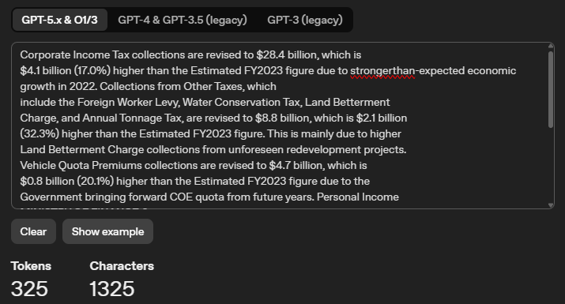
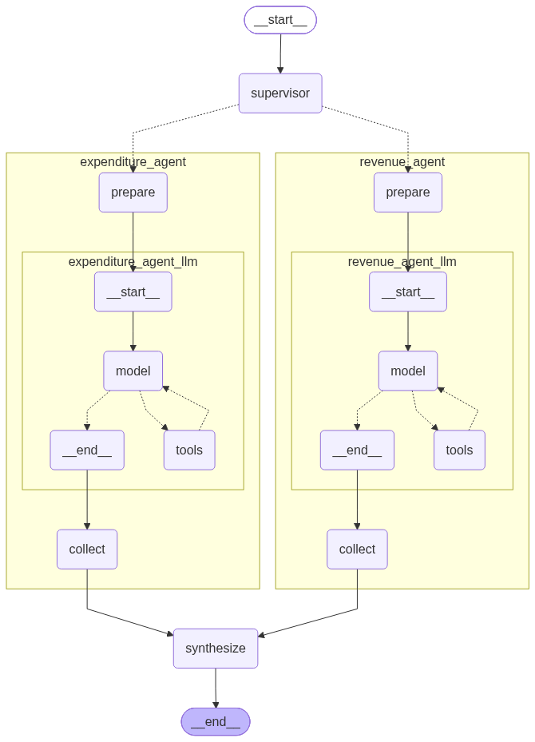
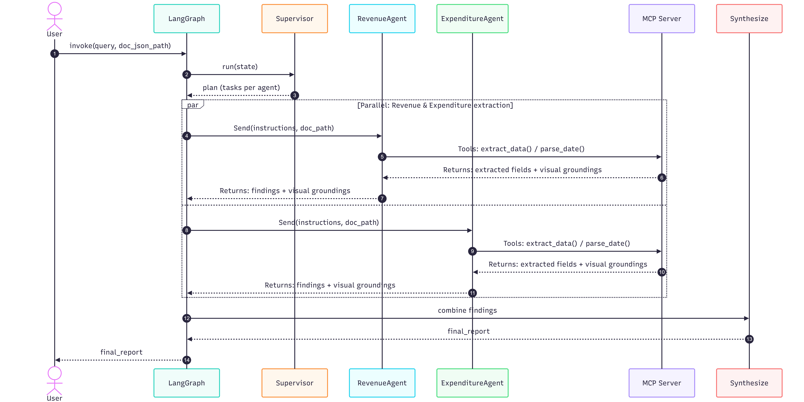
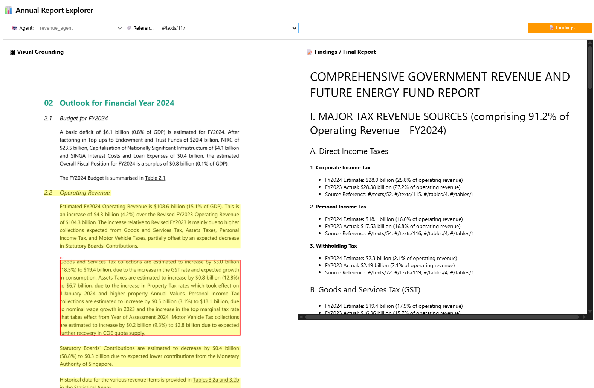

# Table of content
| Section | Description |
| :--- | :--- |
| [Requirements](#requirements) | Things to install |
| [Getting Started](#getting-started) | Setting up the project environment |
| [Machine Specification](#machine-specification) | Notes on machine specification |
| [Part 1: Document Extraction & Prompt-Engineering](#part-1-document-extraction--prompt-engineering) | System design and running instructions |
| [Part 2: Tool Calling & Reasoning Integration](#part-2-tool-calling--reasoning-integration) | System design and running instructions |
| [Part 3: Multi-Agent Supervisor](#part-3-multi-agent-supervisor)| System design and running instructions |


# Requirements
Ensure that the following are installed.

### For running the application
- uv installed: `pip install uv`

### For running MCP Inspector (if necessary)
- nodejs installed `sudo apt install nodejs`
- npm installed `sudo apt install npm`

# Getting Started
1. Clone the repository
```bash
git clone https://github.com/Joanna-Khek/ai-engineering-assignment
cd ai-engineering-assignment
```

2. Set up environment variables (Anthropic API Key)
```bash
# Update the .env with the environment variables
cp .env.example .env
```

3. Modify the docling settings in `configs/main.yaml` file if necessary. By default, it assumes you are using a CUDA device.

```yaml
docling:
  use_flash_attention: false
  device: "cuda" # cpu or cuda
```

4. Set up the environment and dependencies
```bash
uv sync
```

# Machine Specification

The assignment was done on a machine with the following specifications:

| Component | Specification |
| :--- | :--- |
| CPU | AMD Ryzen 7 5800H |
| RAM | 32GB |
| GPU | NVIDIA GeForce RTX 30602GB |
| VRAM | 6GB Dedicated GPU Memory |


# Part 1: Document Extraction & Prompt-Engineering

## 1.1 How to run?
To run part 1, please refer to `notebooks/part1.ipynb`.
| Step | Comments |
| :--- | :--- |
| Step 1: Understand the document  | Just an introductory step to understand the data. Nothing to run. |
| Step 2: Extracting the document | Note that the total runtime for this step is about 60 mins. I have provided the extracted json content in the `/data` folder so this step is not necessary to run. |
| Step 3: Querying the document | Run the cells in this step to get the answers to the five queries. Not sure if there is a typo with Query 1 as it seems like the we should query for FY2023 instead of 2024? Note: Not sure when to use Financial Year 2023 and when to use 2024 |

## 1.2 Understanding the data source
There is only one document and it consists of 37 pages. Since it is relatively short, a vector database might not be necessary.

The document has a typical PDF sturctured layout, with different sections, tables and various charts (bar graph, line chart, pie chart).

## 1.3 Extracting the document

I used the Docling library for the extraction. Reason is because Docling uses a deep learning object-detection model to identify and classify page regions (text, tables, pictures), rather than just naive parsing. This produces bounding-box and page-number metadata for every extracted element, which is useful for visual groundings. It is also extremely simple to set up the extraction pipeline.

The docling pipeline consists of the following components:

| Component | Justification |
| :--- | :--- |
| Accelerator | Since a GPU is available in my machine, I use this to speed up the parsing process. However, FlashAttention2 was not activated due to out-of-memory issue. |
| Chart Extraction | Since there are bar graphs, line charts and pie charts in the document, in order to query it using natural language, we convert it to structured data and a summary. This is done via vision language model `granite-vision-v4` |
| Table Extraction | There are many tables in the document so it is important that we parse the table accurately. Docling's `do_table_structure` allows us to extract and reconstruct the table/ |
| Generate Page Images | To verify the results, it is often best practice to generate visual groundings. This option allows the image to be encoded in the JSON file as a base64 string.|

| Generate Picture Images | Chart extraction operates on individual picture crops rather than full page. Hence, this component helps in saving the cropped image for each detected chart. |

> Note: The total time for extraction took 63 mins. I have included the extracted .json in the `/data` folder so we can just directly read the json file to generate the results.

## 1.4 Choosing the embedding model

The first consideration is the max token size of the embedding model. To decide which embedding model to use, I first identified the longest paragraph in the document. This matters because different embedding models have different max token sizes, and during the chunking stage (if necessary), we ideally want each entire paragraph to be chunked together, since each paragraph represents a single idea. To do this, I took the longest paragraph in the document and used [OpenAI's tokenizer](https://platform.openai.com/tokenizer) to calculate its total token count. The longest paragraph (`Section 1.2, Operating Revenue`) came out to 325 tokens.



Second consideration is whether we need domain specific embeddings. Since the document is a generic document, we don't have to consider domain specific embeddings.

With those two considerations in mind, I decided to use the  `sentence-transformers/all-MiniLM-L6-v2`, which is a small model (just 22.7M parameters) with 384 dimensions and has a max token size of 512.

## 1.5 Generative model choice
I am using Anthropic's API and there are a few models to choose from. I chose the Claude Haiku 4.5 model as our application is relatively simple and does not require much complex reasoning. It is also the cheapest and fastest.

To cut down on the total number of tokens in the docling document, I kept only the fields necessary for the LLM to generate an answer such as the text, labels, and reference (for visual grounding). This brought the total context down from 1M to 32K tokens, which fits comfortably within the Claude Haiku model's context window. This leaner JSON is what gets sent to the LLM as context.

## 1.6 System prompt prompt caching
To save on token costs, I placed the document (in the form of a path) in the system prompt, since it remains identical across every query. Because prompt caching works by reusing previously processed tokens for content that hasn't changed, placing static elements like the document path at the start of the prompt (in the system prompt) maximizes the portion of the request that can be cached, significantly reducing the number of tokens billed on each subsequent call.

# Part 2: Tool Calling & Reasoning Integration
## 2.1 How to run?
To run part 2, please refer to `notebooks/part2.ipynb`.
| Step | Comments |
| :--- | :--- |
| Step 1: Setting up the local MCP server  | The server can be found in `src/ai_engineering_assignment/part2/extractor_server.py` |
| Step 2: Binding tools to the model | Run the cells in this step to bind the tools to the model |
| Step 3: Querying the LLM | Run the cells to obtain the final result for the two queries |

## 2.2 Schema Design
To get back the structured dictionary required, I used structured output, with the schema defined in `src/ai_engineering_assignment/part2/schema/query.py`.

For the `status` field, instead of relying on the LLM, I realized that since the logic is rule-based, it could be computed directly via Pydantic's `model_validator`. This saves on token cost and avoids any incorrect classification by the LLM.

## 2.3 Single Agent Design
I used LangChain's `create_agent` method to create a single agent, which has access to two tools defined in the local MCP server.


The local MCP server exposes two tools:
- `extract_data`: Used to extract information from a document.
- `parse_date`: Normalizes dates into ISO format (YYYY-MM-DD). To trigger this tool, the system prompt instructs the LLM to always call it whenever any form of date is extracted.

When a query comes in, the LLM decides whether any tools are required to answer it. If so, the relevant tool is triggered and the result is parsed back into the LLM. If no further tools are required, the loop ends and the final answer is returned to the user.


# Part 3: Multi-Agent Supervisor
## 3.1 How to run?
To run part 1, please refer to `notebooks/part1.ipynb`.
| Step | Comments |
| :--- | :--- |
| Step 1: Build the graph  | Run this section to build the graph. The graph can be found in `src/ai_engineering_assignment/part3/graph.py`  |
| Step 2: Helper functions | These are just some helper functions to help with the streaming and formatting of the output |
| Step 3: Testing the queries| Run the cells in this step to test the queries. The output contains traces of the individual nodes in the graph, as well as the tool calls and outputs. There is a widget at the end for you to explore the findings from each agent as well as the final report with visual groundings. |


## 3.2 System Design
For the multi-agent set up, we will use the subagent multi-agent pattern, where we will send instructions to the two agents in parallel.



1. When a query comes in, the supervisor receives it and generates a plan. Depending on the query, the supervisor decides which agent(s) are required, then formulates instructions to be sent to the required agent(s). These instructions break down the query and tell the agents what information to look for.

2. The instructions are sent to the relevant agents in parallel, using LangGraph's `Send()` method.

3. Each individual agent first goes through the prepare stage, where it uses the tools available to it to gather the required information.

4. Once an agent has gathered all the required information, it exits the loop and enters the collect stage. In this stage, it extracts the images from the gathered information, to be used for downstream visual grounding.

5. Finally, the results from all agents are synthesized to form the final report.



## 3.3 Widget for exploring the agents and final output

A widget was also created to help explore the findings from the different agents, along with their visual groundings. The final report can also be viewed within the widget.


